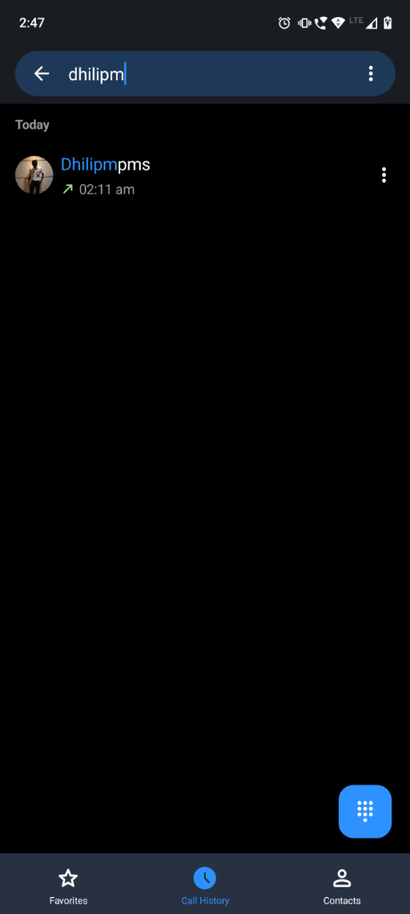
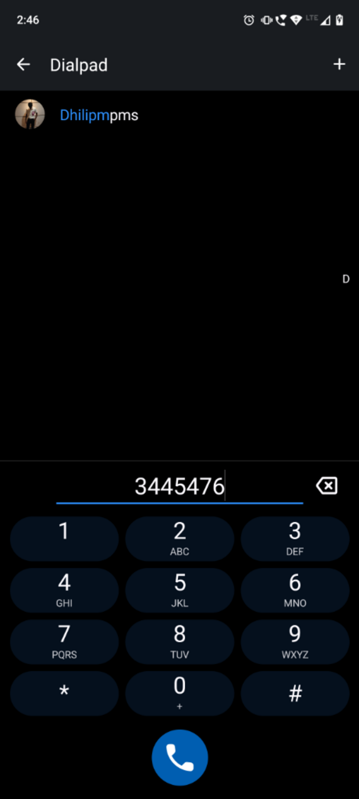
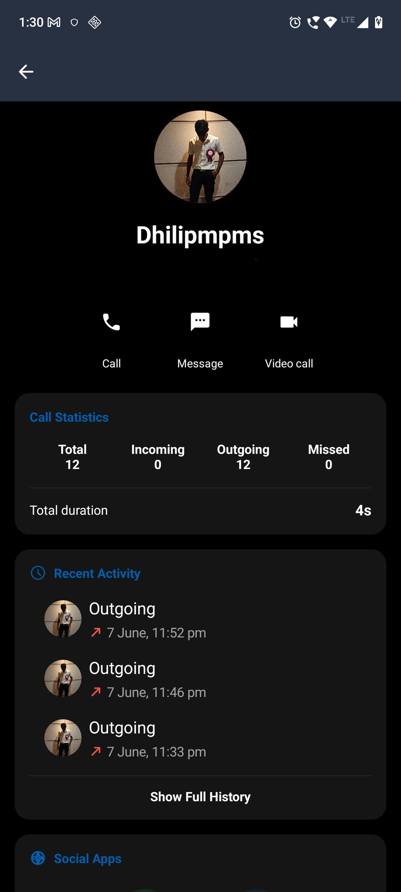
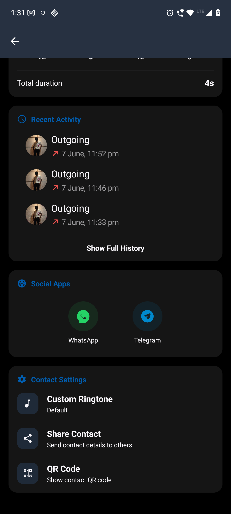
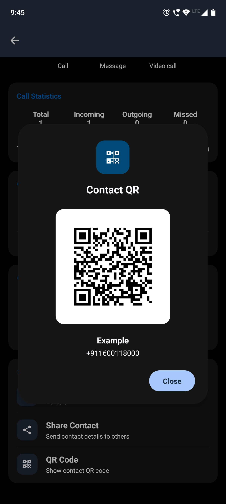
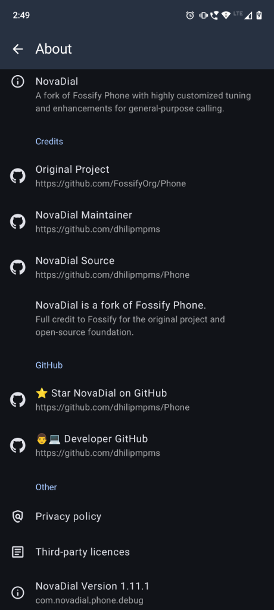

# NovaDial

<p align="center">
  
</p>

NovaDial is a modern Android dialer focused on speed, privacy, AMOLED-friendly design, and a clean calling experience.

## About

NovaDial is a community-driven fork of Fossify Phone with additional UI improvements, performance optimizations, customization options, and dialer enhancements.

The goal of NovaDial is to provide a modern and feature-rich dialer while remaining lightweight, privacy-friendly, and open source.

## Features

* Fast call history loading
* Optimized recent calls view
* Contact-centric call history
* AMOLED Black theme support
* Multiple Recents UI styles
* Improved call history grouping
* Modernized user interface
* Material Design components
* Dual SIM support
* Contact management
* Favorites support
* Offline-first experience
* No advertisements
* Open source

## Screenshots

<p align="center">
  
  
  
  
  
  

</p>

## Installation

Download the latest APK from the Releases section or build from source.

## Building

### Clone the repository

```bash
git clone https://github.com/dhilipmpms/NovaDial.git
cd NovaDial
```
### Configure Android SDK

create a `local.properties` file in the project root and specify the path to you Android SDK:

```properties
sdk.dir=/path/to/your/Android/sdk
```
Examples:

```properties```
sdk.dir=/home/username/Andoird/sdk
```
### Build the application

Debug build:

```bash
./gradlew assembleCoreDebug
```

Release build:

```bash
./gradlew assembleCoreRelease
```

Generated APKs can be found in:

```text
app/build/outputs/apk/
```

## Credits

NovaDial is based on the excellent Fossify Phone project.

Original Project:

https://github.com/FossifyOrg/Phone

Huge thanks to the Fossify team for creating and maintaining the original open-source application.


## Maintainer

Dhilip

GitHub:
https://github.com/dhilipmpms

NovaDial Repository:
https://github.com/dhilipmpms/NovaDial

## License

NovaDial follows the same open-source license as the original Fossify Phone project.

Please refer to the LICENSE file for details.

## Disclaimer

NovaDial is an independent community fork and is not affiliated with, endorsed by, or maintained by the Fossify organization.

All credit for the original foundation of this project belongs to the Fossify contributors.
